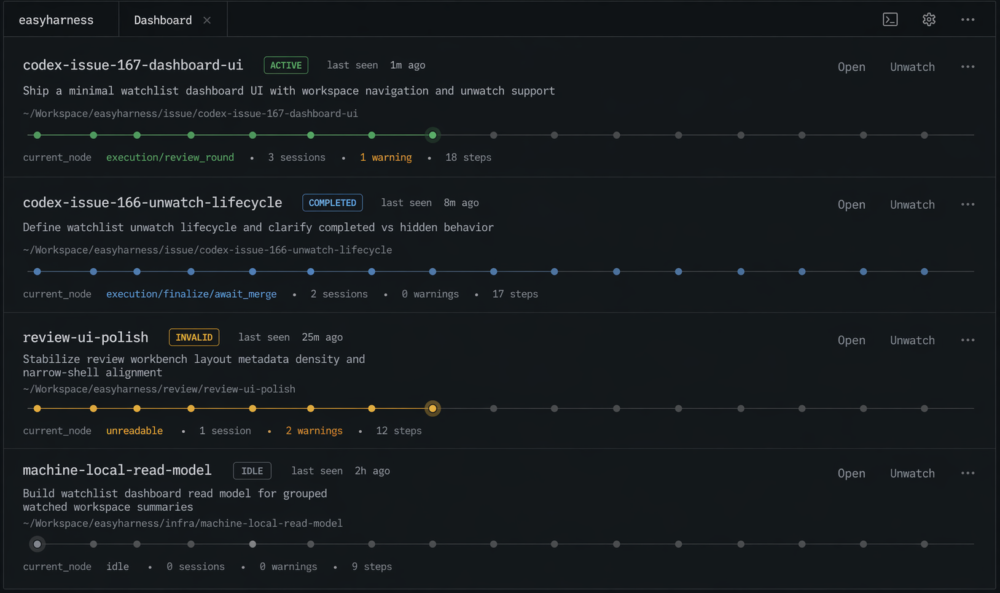

# Dashboard Home Reference

This supplement captures the accepted dashboard-home direction for issue
`#167`. It is a design baseline for execution, not a pixel-perfect spec. The
goal is to keep future implementation aligned with the agreed information
hierarchy and product tone even if later execution happens in a different
thread or by a different agent.

## Reference Image

## Design Comments

- Preserve the same dark, dense, IDE-like product family as the existing
  workspace workbench. The dashboard is the home/explorer for that product,
  not a separate SaaS dashboard.
- The dashboard home itself does **not** have a left rail. The left rail stays
  in workspace detail only.
- Use one vertically stacked list of workspace slabs sorted by `last_seen_at`
  descending. Do **not** reintroduce lifecycle-grouped sections for the home
  page.
- Within each workspace slab, keep the information hierarchy:
  1. workspace/folder name
  2. plan title, allowed to read as the main secondary content and expand to
     a controlled two-line presentation when needed
  3. path/meta line
  4. progress axis
  5. compact status metadata
- Keep action affordances visually quiet. `Open` and `Unwatch` should exist,
  but they should not dominate the item width or overpower the content.
- The progress axis uses a **fixed overall visual width** across items so the
  list aligns cleanly. That width is a layout rule only.
- The number of rendered nodes on the progress axis should come from actual
  workflow or plan structure. Do **not** fake one shared slot template and then
  merely light different subsets of the same slots.
- The axis should stay minimal: no persistent stage labels under the line, no
  percent-complete bar, and no speculative activity math. Raw workflow nodes
  such as `execution/step-3/implement` belong in node hover/focus text, not as
  always-visible card copy.
- The older mockup's `x sessions` text was deliberately rejected. For v1, only
  show compact metadata backed by stable product meaning, such as warnings,
  review state, blockers, or similar already-defined signals. Avoid showing
  raw `current_node` as a permanent metadata chip on each card.
- Avoid large colorful avatars, hero headers, oversized CTA buttons, and other
  generic SaaS dashboard patterns that drift away from the current workbench
  shell.
- Avoid an extra outer framed section box around the whole dashboard list. The
  page should be topbar plus stacked slabs, not title-inside-panel-inside-page.

## Implementation Notes

- The reference image is directional and intentionally denser than the earlier
  exploratory mockups.
- If the implemented UI needs small responsive adjustments, preserve the
  vertical information order rather than reverting to a left/middle/right card
  composition.
- The workspace-detail side remains a separate concern. This supplement is
  specifically for the dashboard home layout and tone.
